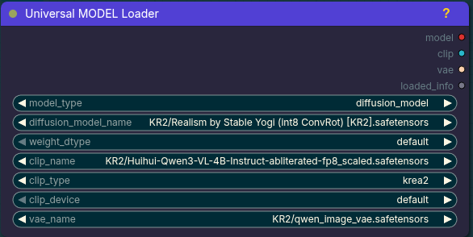

# ComfyUI Universal Model Loader



Author: Zoltar358

A local ComfyUI custom node pack that provides one loader node with a first-step `model_type` selector. The browser UI hides irrelevant parameters after you choose the type.

## Installation

### ComfyUI Manager

This nodepack has been submitted for ComfyUI Manager listing. After it is accepted, install it from:

1. Open ComfyUI.
2. Click **Manager**.
3. Click **Install Custom Nodes**.
4. Search for **ComfyUI-Universal-Model-Loader**.
5. Click **Install** and restart ComfyUI.

### Manual install

From your `ComfyUI/custom_nodes` directory:

```bash
git clone https://github.com/Zoltar358-ComfyUI/ComfyUI-Universal-Model-Loader.git
```

Then restart ComfyUI and hard-refresh the browser page.

### Updating

From the installed nodepack directory:

```bash
git pull
```

Then restart ComfyUI and hard-refresh the browser page.

### Optional dependency for GGUF mode

`gguf_unet` mode requires [ComfyUI-GGUF](https://github.com/city96/ComfyUI-GGUF):

```bash
cd ComfyUI/custom_nodes
git clone https://github.com/city96/ComfyUI-GGUF.git
```

## Node

**Universal MODEL Loader** (`model/loaders`)

Outputs:

1. `model` — `MODEL`
2. `clip` — `CLIP`
3. `vae` — `VAE`
4. `loaded_info` — `STRING`

Supported modes:

- `checkpoint` — loads from `models/checkpoints`, returns MODEL/CLIP/VAE.
- `diffusers` — loads a folder under `models/diffusers` containing `model_index.json`, returns MODEL/CLIP/VAE.
- `diffusion_model` / `unet` — loads from `models/unet` or `models/diffusion_models`, returns MODEL, CLIP and VAE.
- `gguf_unet` — loads `.gguf` diffusion models using ComfyUI-GGUF, returns MODEL, CLIP and VAE.

The node uses a purple/dark-teal theme matching the screenshot you provided. The frontend extension collapses every widget not relevant to the selected `model_type`; MODEL-only types always load CLIP and VAE from this node.

## Notes

For MODEL-only modes, choose the CLIP/text encoder and VAE directly in the Universal MODEL Loader.

GGUF mode requires `custom_nodes/ComfyUI-GGUF` to be installed.
